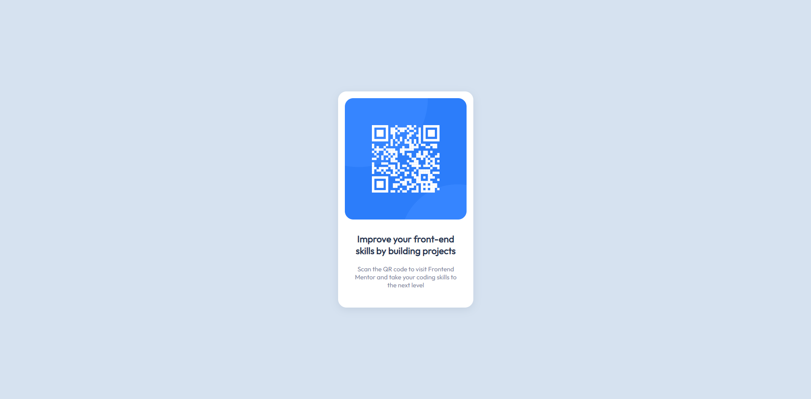

# Frontend Mentor - Solução de componente de QR code

<a href="/README.md">Em inglês</a>   

Esta é uma solução para o [Desafio do componente de QR code no Frontend Mentor](https://www.frontendmentor.io/challenges/qr-code-component-iux_sIO_H). Os desafios do site Frontend Mentor estão ajudando a melhorar minhas habilidades de codificação criando projetos reais do dia a dia de um desenvolvedor front-end.

## Índice

- [Visão Geral](#visáo-geral)    
  - [Screenshot](#screenshot)   
- [Meu Processo](#meu-processo)  
  - [Construído Com](#construído-com)  
  - [O Que Aprendi](#o-que-aprendi)
- [Autor](#autor)
- [Agradecimentos](#agradecimentos)

## Visão Geral

### Screenshot

Desktop 1920px

Mobile 375px

## Meu Processo

### Construído Com
- HTML5 semântico
- Variáveis CSS
- Layout responsivo

### O Que Aprendi
I was able to put into practice the semantic HTML in the structure of the components.  
I reinforced the development of variables and media queries in CSS.  

## Autor
- Frontend Mentor - [@andrebdasilva](https://www.frontendmentor.io/profile/andrebdasilva)

## Agradecimentos
- Muito obrigado a todos do Frontend Mentor